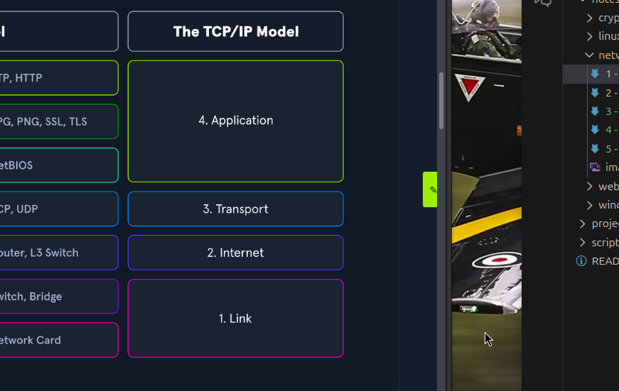

# Network Types

Network Types Depend on how large they are and how much area they cover geographically

1. PAN

## 1 - PAN - Personal Area Network

- Networks Used On a personal level
- BlueTooth , Infrared , NFC

## 2 - LAN - Local Area Network

- Group of devices that are located in the same building
- Offices , Homes , Clinic
- Ethernet Lan

## 3 - WLAN - Wireless Local Area Network

- Same as LAN but wireless (without using cables)
- Our Wifi in our home is an example of Wlan

## 4 - CAN - Campus Area Network

- Network that jopins 2 or more lans together within a limited area

## 5 - MAN - Metropolitan Area Network

- Larger than CAN
- Spans over buildings and cities

## 6 - SAN - Storage Area Network

- DATA CENTRE

## 7 - WAN - Wide Area Network

- Largest Type of Network
- Example - INTERNET 

  
