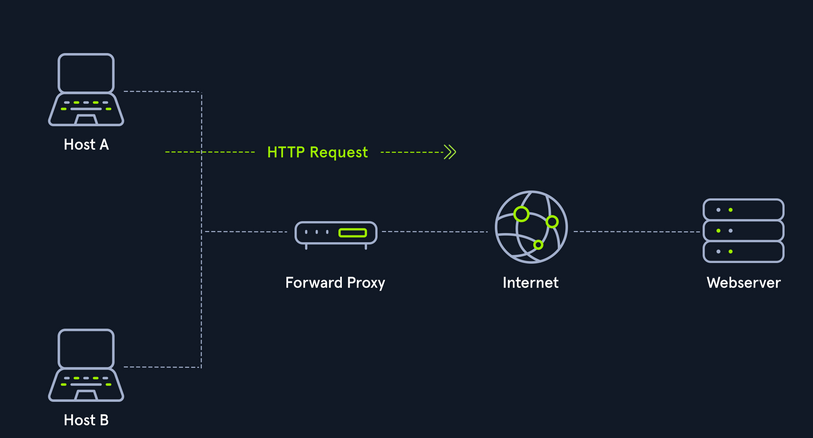

# Proxies

-  A proxy is when a device or service sits in the middle of a connection and acts as a mediator. The mediator is the critical piece of information because it means the device in the middle must be able to inspect the contents of the traffic. 

## -> Types

- Dedicated Proxy / Forward Proxy
- Reverse Proxy
- Transparent Proxy

### Forward Proxy

-  A Forward Proxy is when a client makes a request to a computer, and that computer carries out the request.
-  In corporate - Sensitive Computers do not have direct access to the internet , to access the internet they must go through a proxy . This is a powerful defense against malware
-  Example : - BurpSuite
-  
